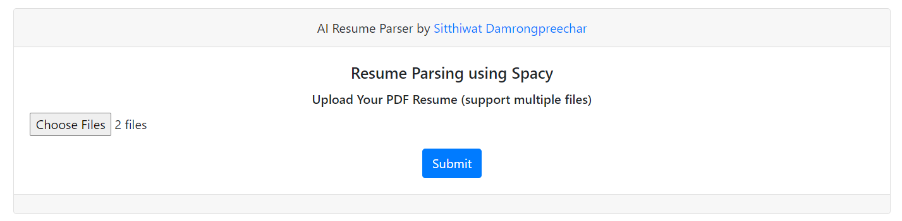
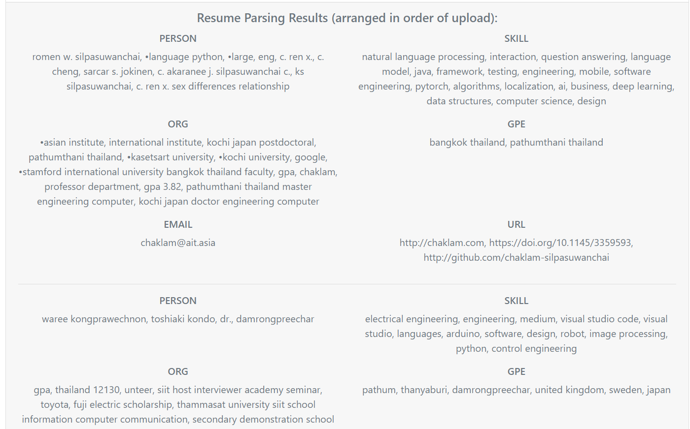
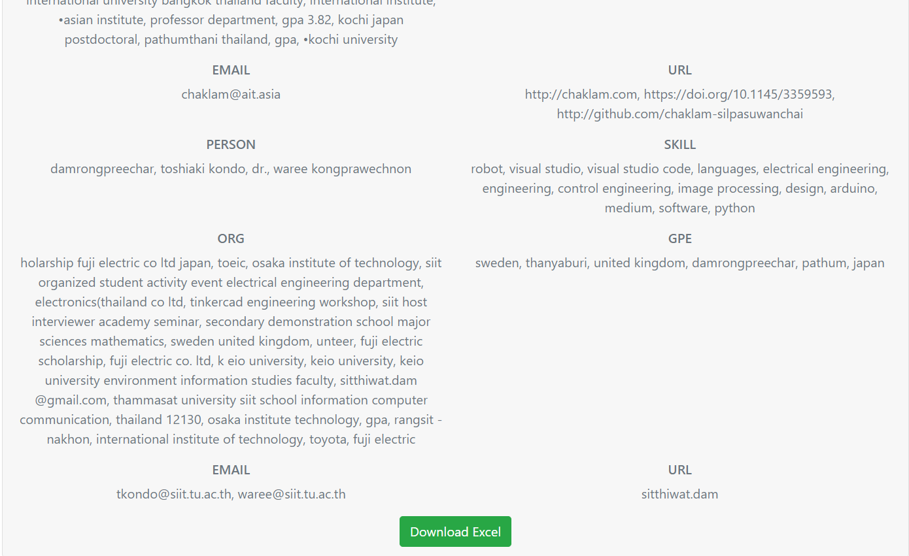
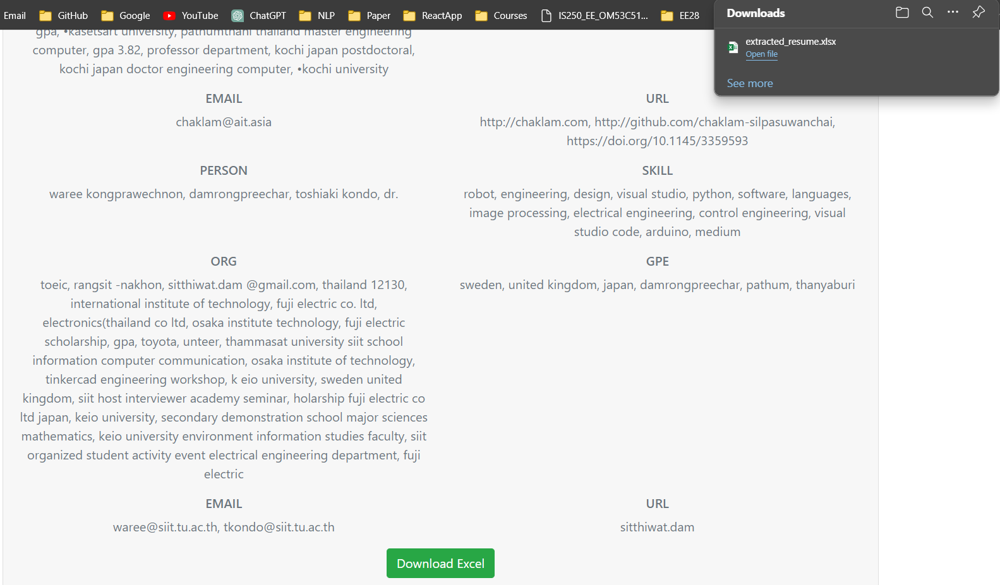
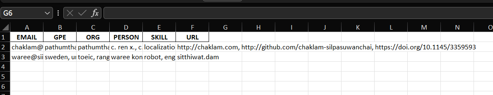

# A4_Resume_Parser
 
## Parser by Spacy
The complete training process is detailed within the `A4_st123994.ipynb` notebook, providing in-depth instructions. Feel free to study and build upon this comprehensive guide for a better understanding of the Resume Parser.


## Web application with Flask
This web application is built using Flask, a popular web framework in Python. All functionalities are operated by the funtions which is structured similarly to the one in the Jupyter notebook.

### Quick Start with Docker Compose

1. **Clone the repository:**
    ```bash
    git clone https://github.com/SitthiwatDam/A4_Resume_Parser.git
    ```

2. **Navigate to the project directory:**
    ```bash
    cd A4_Resume_Parser
    ```

3. **Build and run the Docker containers:**
    ```bash
    docker-compose up -d
    ```

4. **Access the application:**
    - Open your web browser and go to [http://127.0.0.1:5000/](http://127.0.0.1:5000/)

5. **Submit a translate sentence:**
    - Enter a sentence in the text area.
    - Click the "Submit" button.
    - A translated sentence will show below.

6. **Stop the application when done:**
    ```bash
    docker-compose down
    ```

### Web Application Interface
For the application interface, users are required to upload the resume files which is in the PDF format. After that click the "submit" button. The result will show in form of table which row arrage in order of upload. Their will be 5 features that extracted: Person,Skill, Organization, Geopolitical, Email, and URL. Moreover, user can download their extract resume as an excel file by clicking "Download Excel" button.
#### Multiple inputs 

#### Result

#### Download Excel file


#### Excel file
